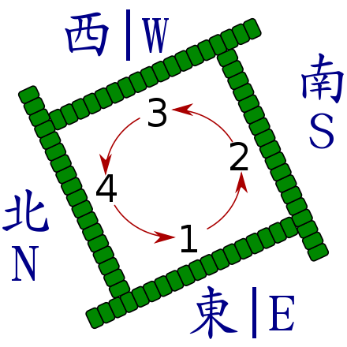

# Mahjong


[](https://circleci.com/gh/cc4i/mahjong0)

[](https://goreportcard.com/report/github.com/cc4i/mahjong0)

## Description
[Mahjong](./docs/All-Concept.md) has built-in mechanism to abstract best practice away from traditional solutions, so builders can quickly build new abstract block or full solution based on other building blocks, called Tile.

People can use Hu to quickly spin up full solutions or resources on AWS with industry best practice and non-industry experience required.

## Prerequisite

- Install [Docker](https://docs.docker.com/desktop/#download-and-install)
- Install [CDK](https://github.com/aws/aws-cdk)
- [Setup AWS configuration and credential file](https://docs.aws.amazon.com/cli/latest/userguide/cli-configure-files.html)
- Download latest [mctl](https://github.com/cc4i/mahjong0/releases) [ Linux / Darwin / Windows ]

## Quick Start

```bash

# Run dice as coantainer
docker run -d -v ~/.aws:/root/.aws -p 9090:9090 herochinese/dice

# Kick start browser for first trial (On Darwin)
open http://127.0.0.1:9090/toy

```

## Develope a Tile

Check out following for an EKS quick start, and click [here](./docs/How-to-Build-Tile.md) for more detail to develope Tile.

```bash

# Run dice on DEV mode in order to loading your Tile
docker run -it -v ~/mywork/mylabs/csdc/mahjong-0/tiles-repo:/workspace/tiles-repo \
    -v ~/.aws:/root/.aws \
    -e M_MODE=dev \
    -p 9090:9090 \
    herochinese/dice

# Initial a Tile project with your favorite name
mctl init tile -n sample-tile

# Deploy Tiles with your very first try. 
cd sample-tile
mctl deploy -f ./eks-simple.yaml

# Make your own bespoke Tiles ...

```


## Develope a Hu

Click [here](./docs/How-to-Build-Hu.md) for more detail to develop Hu.


## Examples

### Tiles

|        Tiles    | Version | Description      |
|-----------------|---------|------------------|
| Basic Network | [v0.0.1](./tiles-repo/network0/0.0.1)  | The classic network pattern cross multiple availibilty zone with public and private subnets, NAT, etc. |
| Simple EKS| [v0.0.1](./tiles-repo/eks0/0.0.1)| The basic EKS cluster, which uses EKS 1.15 as default version and depends on Network0. |
| | [v0.0.5](./tiles-repo/eks0/0.0.5)| Update EKS default version to 1.16 and expose more options. |
| EKS on Spot | [v0.5.0](./tiles-repo/eks-with-spot/0.5.0)| Provison EKS 1.16 as default and using auto scaling group with mixed spot and normal (4:1) instances. Also has Cluster Autoscaler, Horizontal Pod Autoscaler and Spot Instance Handler setup. |
|EFS | [v0.1.0](./tiles-repo/efs/0.1.0)|The basic EFS conpoment and based on Network0. EFS is a perfect choice as storage option for Kubernetes. |
|ArgoCD | [v1.5.2](./tiles-repo/argocd0/1.5.2)|The Argocd0 is basic component to help build up GitOps based CI/CD capability, which depends on Tile - Eks0 & Network0.|
|Go-Bumblebee-ONLY| [v0.0.1](./tiles-repo/go-bumblebee-only/0.0.1) | This is demo application, which can be deploy to Kubernetes cluster to demostrate rich capabilities.|
|Istio | [v1.5.4](./tiles-repo/istio0/1.5.4) | Setup Istio 1.6 on EKS with all necessary features. Managed by Istio operator and Egress Gateway was off by default. |


### Hu

|        Hu    | Version | Description      |
|-----------------|---------|------------------|
| Simple EKS| [v0.1.0](./templates/eks-simple.yaml)| Quick launch with few lines of yaml.|
| EKS with Spot instance| [v0.1.0](./templates/eks-spot-simple.yaml)| Quick launch EKS cluster with mixed spot and on-demand instances, as well as handling spot termination, cluster auto scaler and HPA. |
| Simple ArgoCD | [v0.1.0](./templates/argocd-simple.yaml) | Setup ArgoCD on EKS with simple configuration.|
| Basic CD with ArgoCD | [v0.1.0](./templates/argocd-with-app.yaml) | Building a modern CD with example applicaiton on GitHub, all you need is a GitHub token.|


## What to Next

- [X] Istio
- [X] Knative 
- [X] Kubeflow
- [X] AI on Kubernetes/EKS


## Referenes

- [Node.js](https://nodejs.org/en/download/) ( ≥ 10.12.0 ) 
- [AWS CLI 2](https://docs.aws.amazon.com/cli/latest/userguide/install-cliv2.html) 
- [CDK](https://github.com/aws/aws-cdk)
- [aws-iam-authenticator](https://docs.aws.amazon.com/eks/latest/userguide/install-aws-iam-authenticator.html)
- [Kubectl](https://docs.aws.amazon.com/eks/latest/userguide/install-kubectl.html)
- [Kustomize](https://github.com/kubernetes-sigs/kustomize/blob/master/docs/INSTALL.md)
- [Helm](https://helm.sh/docs/intro/install/)
